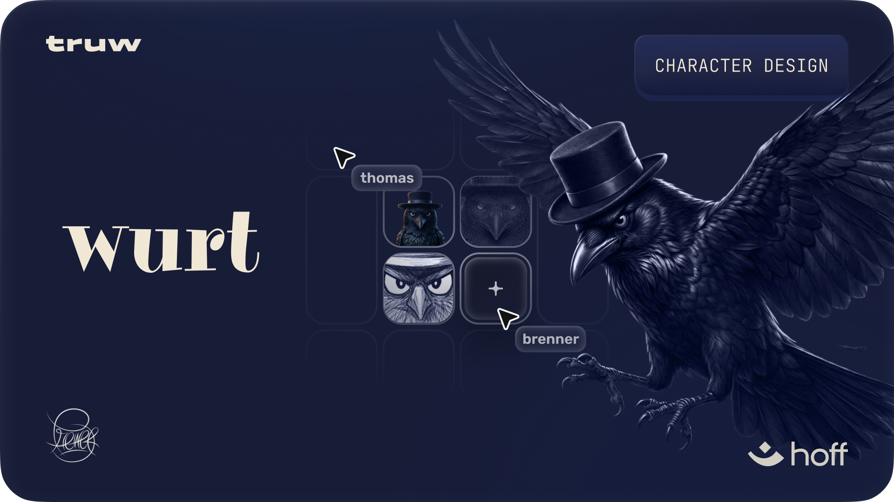

# wurt

wurt is a character design project, a raven in a top hat, built as a mascot for truw in collaboration with hoff research.

this folder gathers everything that came out of the design pass: the early sketches and skeleton studies, a full set of high-res action poses, and the rigged 3d models with animations ready to drop into a scene.

## what's in here

- `glb/`: rigged 3d models with animations (walking, run, falling, storm, batman, fighting fake news, fmz truta, papo reto, wings open).
- `png/highres/`: 13 high-resolution action pose renders, clean background.
- `png/labels/`: the same poses with overlay labels (front no hat, etc.).
- `ske/`: concept sheet with skeleton, silhouettes, and expression studies.
- `wurt-truw-character-hoff.png`: the cover above.

## about the character

wurt is a moody, observant raven: feathers black, eyes sharp, top hat on. the animation set leans into a mix of everyday motion and dramatic beats, so the character can carry both narrative scenes and quick reaction moments.
